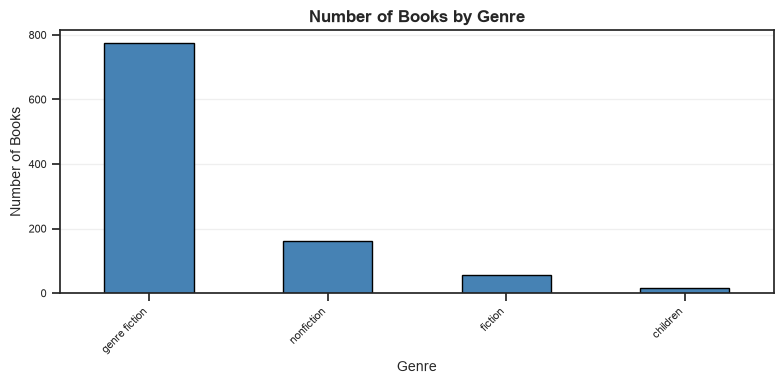
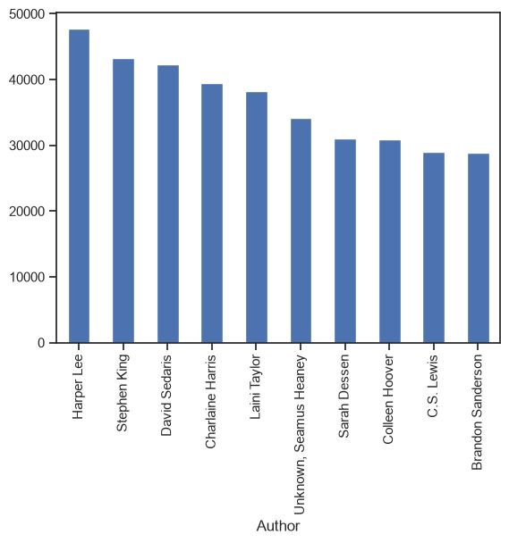
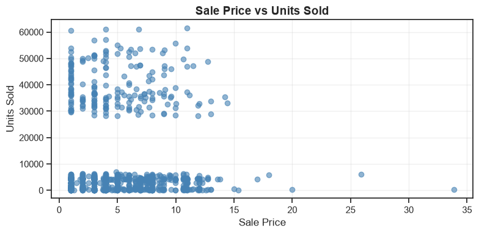
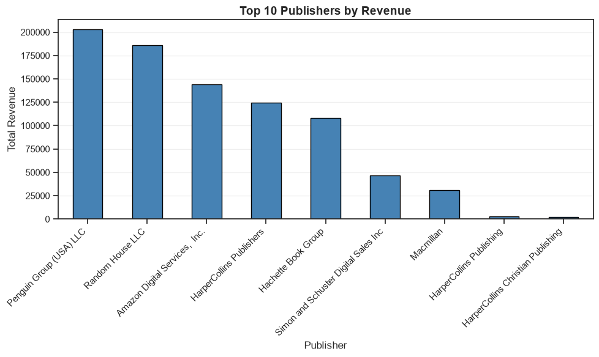
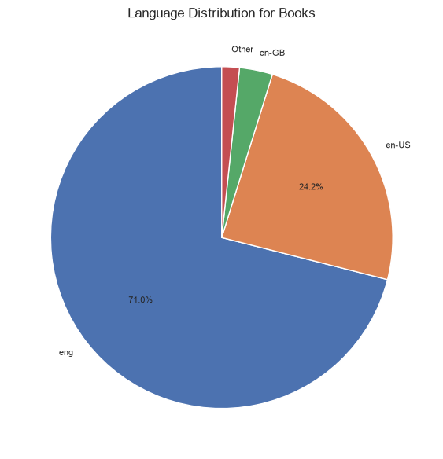

# Book Sales Analysis Project

## Overview
An analysis of book sales data, exploring key metrics such as genre popularity, author performance, pricing strategies, and sales patterns. The project examines different factors that influence book sales to help identify optimal strategies for publishing and marketing.

**Data Source**: [Books Sales and Ratings Dataset](https://www.kaggle.com/datasets/thedevastator/books-sales-and-ratings?resource=download) on Kaggle.

The dataset contains detailed information on book titles, authors, genres, pricing, units sold, revenue, and publisher details.

## The Questions

1. What are the most popular genres and how do they compare?
2. Which authors generate the most revenue and units sold?
3. How does pricing affect units sold and revenue?
4. What are the optimal pricing strategies for books?
5. How do language and publisher affect sales performance?

## Tools Used

- **Python**: Core analysis language
- **Pandas**: Data manipulation and analysis
- **Matplotlib**: Data visualization
- **Seaborn**: Advanced visualizations
- **Jupyter Notebooks**: Interactive analysis
- **Visual Studio Code**: Development environment
- **Git & GitHub**: Version control and project sharing

## Data Import & Cleanup

```python
# Importing Libraries
import pandas as pd
import matplotlib.pyplot as plt
import seaborn as sns
import numpy as np

# Loading Data
df = pd.read_csv('Books_Data_Clean.csv')

# Clean column names (remove trailing spaces)
df.columns = df.columns.str.strip()

# Handle invalid publishing years
df['Publishing Year'] = df['Publishing Year'].replace(0, np.nan)
df = df.dropna(subset=['Publishing Year'])
```

## Analysis

### 1. What are the most popular genres and how do they compare?

### Visualization:

``` Python

genre_counts = df["genre"].value_counts()

plt.figure(figsize=(10, 6))
genre_counts.plot(kind="bar", color='steelblue', edgecolor='black')
plt.title('Number of Books by Genre', fontsize=14, fontweight='bold')
plt.xlabel('Genre', fontsize=12)
plt.ylabel('Number of Books', fontsize=12)
plt.xticks(rotation=45, ha='right')
plt.grid(True, alpha=0.3, axis='y')
plt.tight_layout()
plt.show()
```



### 2. Which authors generate the most revenue and units sold?

### Visualization

``` Python
total_gross_sales_by_author = df.groupby("Author")["gross sales"].sum().sort_values(ascending=False).head(10)

plt.figure(figsize=(10, 6))
total_gross_sales_by_author.plot(kind='bar', color='coral', edgecolor='black')
plt.title('Top 10 Authors by Gross Sales', fontsize=14, fontweight='bold')
plt.xlabel('Author', fontsize=12)
plt.ylabel('Gross Sales (USD)', fontsize=12)
plt.xticks(rotation=45, ha='right')
plt.grid(True, alpha=0.3, axis='y')
plt.tight_layout()
plt.show()
```


### 3. How does pricing affect units sold and revenue?
### 4. What are the optimal pricing strategies for books?

### Visualization

``` Python
plt.figure(figsize=(10, 6))
plt.scatter(df['sale price'], df['units sold'], alpha=0.6, color='steelblue')
plt.title('Sale Price vs Units Sold', fontsize=14, fontweight='bold')
plt.xlabel('Sale Price', fontsize=12)
plt.ylabel('Units Sold', fontsize=12)
plt.grid(True, alpha=0.3)
plt.tight_layout()
plt.show()
```



### Visualization

``` Python
publisher_revenue = df.groupby("Publisher")["publisher revenue"].sum().sort_values(ascending=False).head(10)

plt.figure(figsize=(10, 6))
publisher_revenue.plot(kind='bar', color='steelblue', edgecolor='black')
plt.title('Top 10 Publishers by Revenue', fontsize=14, fontweight='bold')
plt.xlabel('Publisher', fontsize=12)
plt.ylabel('Total Revenue', fontsize=12)
plt.xticks(rotation=45, ha='right')
plt.grid(True, alpha=0.3, axis='y')
plt.tight_layout()
plt.show()

```




### 5. How do language and publisher affect sales performance?

### Visualization

``` Python
language_counts = df["language_code"].value_counts()

plt.figure(figsize=(10, 8))
plt.pie(language_counts, labels=language_counts.index, autopct='%1.1f%%', startangle=90)
plt.title('Language Distribution for Books', fontsize=14, fontweight='bold')
plt.tight_layout()
plt.show()

```


## Key Takeaways

Book Sales Analysis - Key Takeaways

1. Genre Dominance
genre fiction dominates the market with ~800 books, far surpassing nonfiction (~180), fiction (~60), and children's (~30)

Publisher strategy: Focus on genre fiction for highest market share

2. Language Distribution
English dominates the dataset: en-US (71%) + en-GB (24%) = 95% English-language books

Other languages make up only ~5% of the collection

Takeaway: The market is heavily English-centric

3. Price vs. Units Sold
No clear correlation between price and units sold (scattered distribution)

Some books at $10-20 sell 2,000–6,000 units, while others at similar prices sell fewer

Takeaway: Price alone doesn't drive sales—other factors (author, genre, marketing) matter more

4. Author Performance
Harper Lee leads with ~$48,000 gross sales, followed by Stephen King (~$43,000)

Top 10 authors generate between $29,000–$48,000 each

Takeaway: A small group of top authors generates significant revenue

5. Publisher Revenue
Penguin Group (USA) LLC dominates with ~$205,000 total revenue

Big 5 publishers (Penguin, Random House, Amazon, HarperCollins, Hachette) control ~85% of revenue

Takeaway: A few large publishers capture most of the market

## Overall Recommendations

1. Publish genre fiction – the most popular category

2. Price isn't everything – focus on author reputation and marketing

3. Partner with top publishers – Penguin, Random House, and Amazon lead

4. English-language market is the primary opportunity